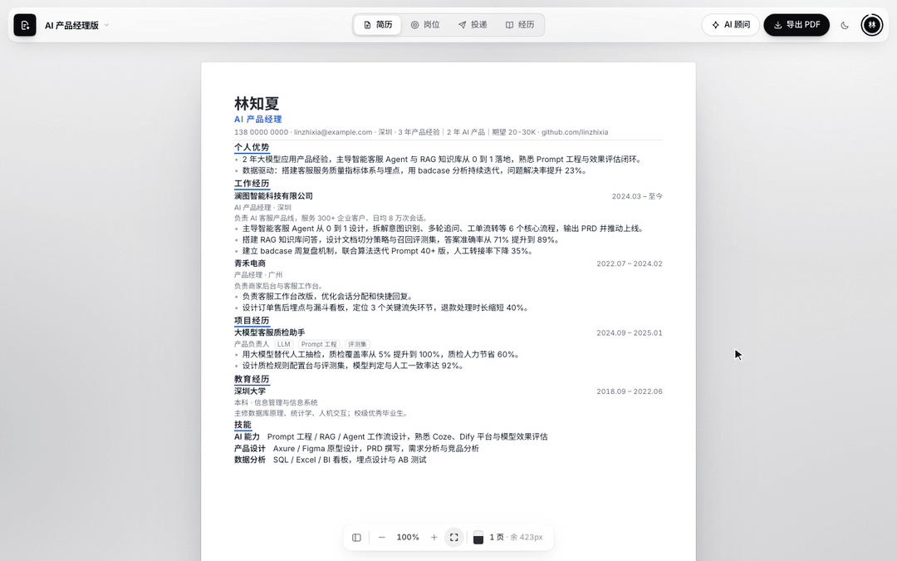
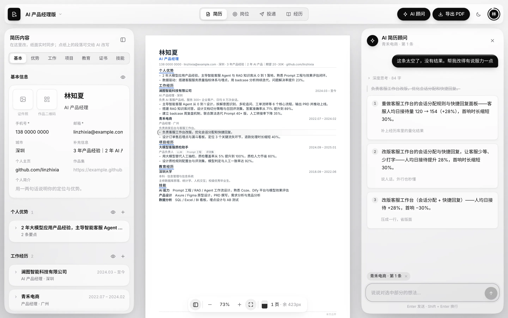
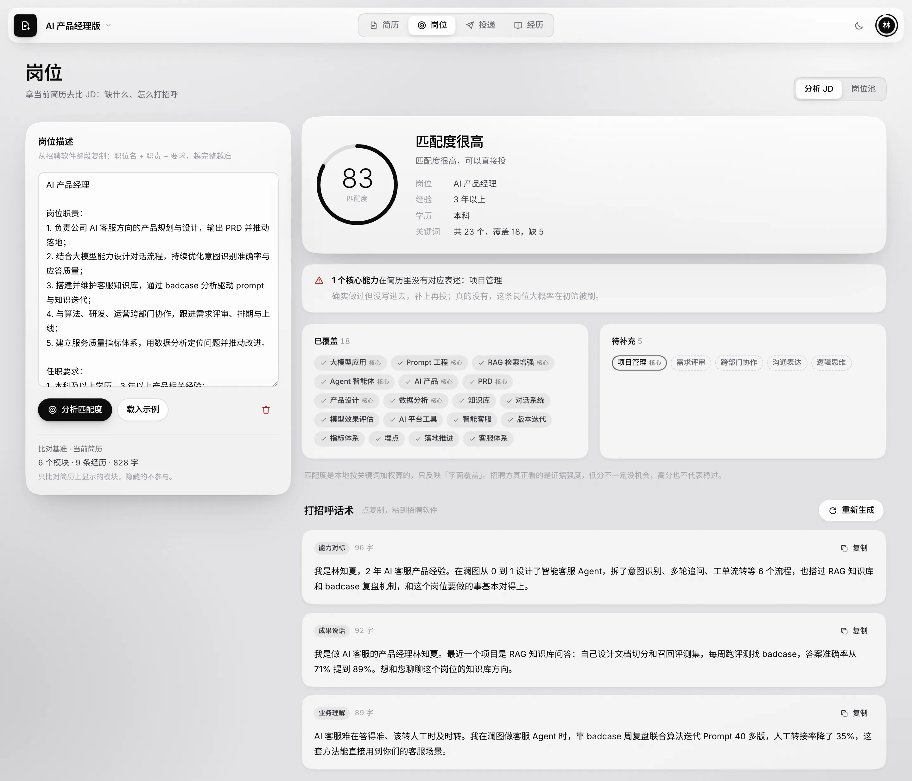
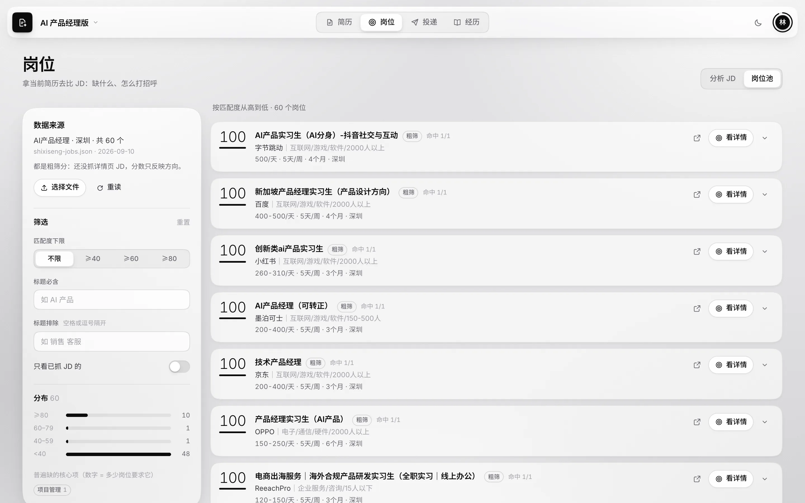
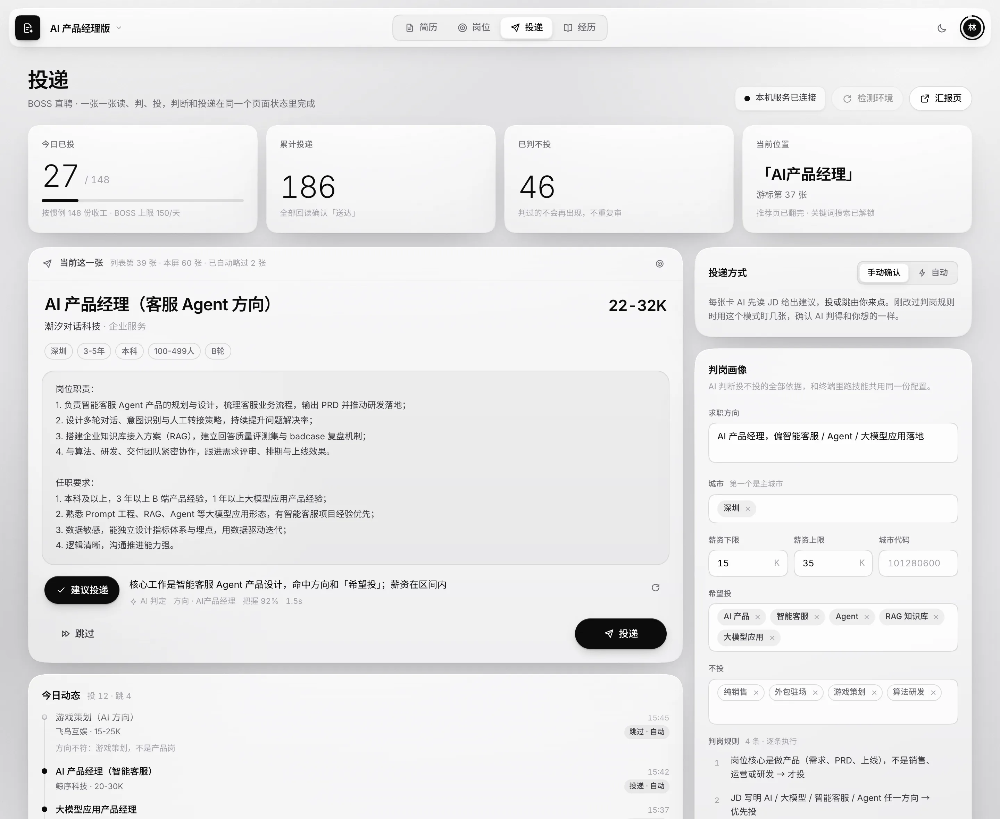
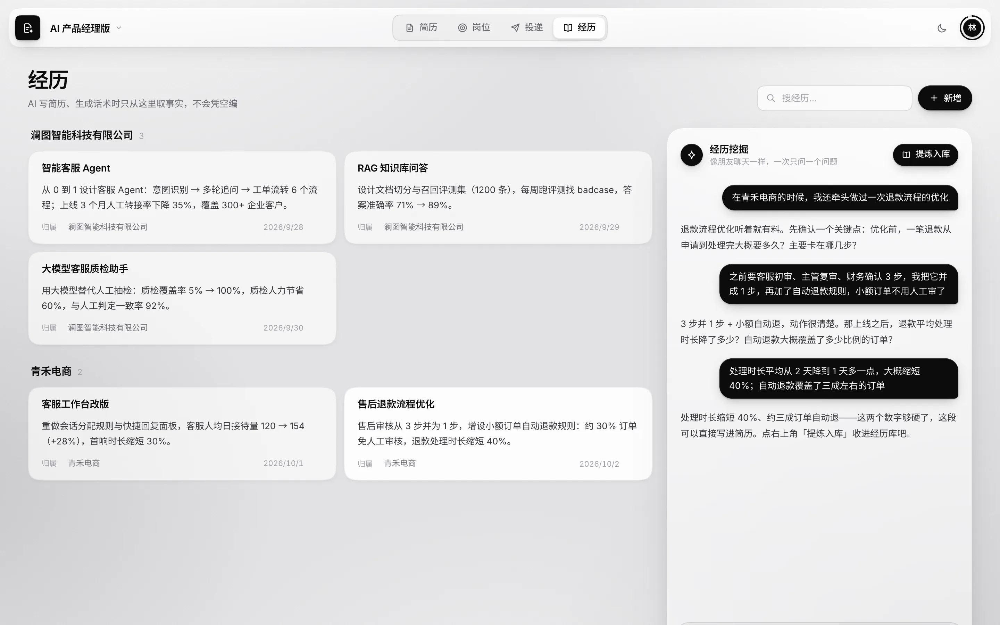
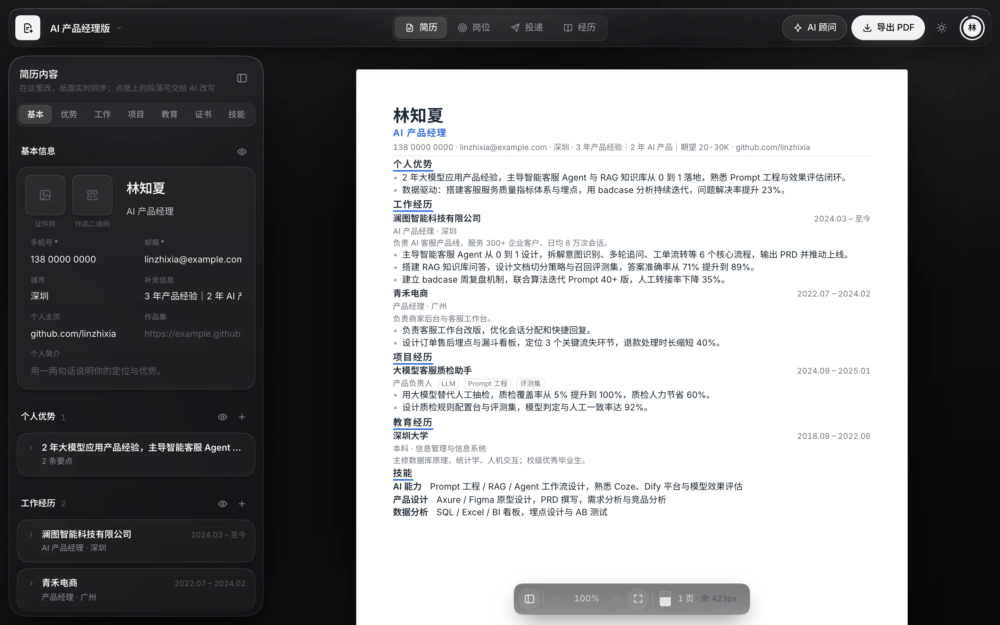

# 简历工作台

**跑在自己电脑上的 AI 求职工作台。写简历、对岗位、投简历、攒经历，都在一个页面里完成。**

AI 会帮你改简历、写打招呼话术、判断一个岗位值不值得投。它引用的每个事实都来自你自己的简历和经历库，不编数字，也不拔高。



<sub>截图里的「林知夏」和其中的公司、数据都是虚构的演示内容。</sub>

> 项目已部署在 [resume.kongbei.xyz](https://resume.kongbei.xyz)，注册就送一笔 AI 试用额度。额度用完了想继续用，欢迎发邮件到 [15916363770@163.com](mailto:15916363770@163.com) 联系我；也可以填自己的模型密钥，不占额度。

## 四个视图，对应求职的四件事

| 视图 | 做什么 |
|---|---|
| **简历** | 所见即所得的 A4 纸，点哪段让 AI 改哪段，一键导出 PDF |
| **岗位** | 粘贴 JD 看匹配度和缺口，生成三条可以直接发的打招呼话术 |
| **投递** | BOSS 直聘逐张处理：读 JD，AI 按你的规则判断，然后投或跳过 |
| **经历** | 和 AI 聊出经历细节，存进经历库，供上面三处引用 |

### 简历：在纸上改，看到的就是成品



- 中间是最终的 A4 成品，左边面板逐字段编辑，改动实时显示在纸上
- 点纸上任意一句（可多选），对 AI 顾问说哪里不满意，它给出 2–3 个候选，点「应用」写回原处
- 底部浮条显示页数和剩余空间，一页装不装得下一眼就知道
- 抬头可以放证件照和作品二维码，导出后二维码照样能扫
- 导出的 PDF 是可选中、可搜索的文字，招聘系统能正常解析关键词
- 最多 3 份档案，可以从一份复制出另一个求职方向的版本

### 岗位：先看差在哪，再决定怎么打招呼



- 粘贴岗位描述，本地按关键词加权算出匹配度，列出已覆盖和待补充的能力，并标出缺失的核心项。这一步不调模型，同一份输入每次结果一样，也能逐项解释
- 「生成话术」按能力对标、成果说话、业务理解三个角度各写一条，每条 60–110 字，复制就能发
- 「岗位池」读取从实习僧抓下来的岗位，按和你简历的匹配度排序，看中哪个就送去做完整分析



### 投递：网页看进度、改设置，执行器自动投



- 网页上点「开始」，你 Mac 上的执行器就在终端里自动走：下一张 → 读 JD → AI 按「判岗画像」判断 → 投或跳
- **关键词计划**：按顺序翻，推荐页翻完换「AI产品经理」，再换「AI工程师」…… 一个翻完自动换下一个
- **每天目标**：投到这个数就停（BOSS 每天上限 150，按惯例最多 148）；遇到异常弹窗、超时、日上限也会立刻停
- **逐张确认**（可选）：打开后每张判完先等你点投或跳，适合刚改完规则时盯几张
- 页面上能看到今日进度、正在处理哪一张、今天的漏斗（看过 → 读 JD → AI 判投 → 投出）和跳过原因分布、实时动态、全部投递记录

> 投递在你自己的 Mac 上执行，网页只是看板和遥控：页面上复制一行安装命令贴进终端，会装好并启动「本机执行器」（`runner/`，只用 macOS 自带的 python3 和 curl），终端里显示的 8 位配对码在网页输入一次即可。执行器只监听本机，关掉网页也照样跑，投递记录只存在你电脑上。它基于 [boss-zhipin-assistant](https://github.com/taohuajianxian/boss-zhipin-assistant) 的 Ego Lite 移植版，需要安装 Ego Lite 浏览器并登录 BOSS 直聘。本地开发用 `pnpm runner`（技能目录默认是项目根下的 `boss-zhipin-assistant-egolite/`）或 `pnpm runner:demo`（模拟 BOSS，不碰浏览器）。

### 经历：先把事实攒下来



- 「经历挖掘」像朋友聊天，一次只问一个问题，追问做了什么、怎么做的、结果是多少
- 聊完点「提炼入库」，整段对话会被整理成一张经历卡
- 后面改简历、写话术、判断岗位时，AI 从简历和经历库里取事实

## AI 不替你编

- 提示词明确要求只引用简历和经历库里有的内容，不编造公司、数字或技能
- 话术的动词强度不能超过简历原文，简历写「接入」，话术就不会写成「主导」
- 判岗拿不准时判不投，并写明哪里不确定

## 线上版：注册就能用

[resume.kongbei.xyz](https://resume.kongbei.xyz) 上的版本不用自己部署，也不用准备模型密钥：

- 用邮箱注册，收一个验证码就行，一个邮箱只能注册一次。注册送一笔 AI 试用额度，够改完一份简历
- AI 按模型实际消耗的 token 扣额度，顶栏随时能看到还剩多少，快用完时会亮一个小红点
- 有自己的 MiniMax、DeepSeek 等模型密钥的话，在头像菜单「AI 额度」里填上，之后所有 AI 功能都走你的密钥，不扣额度。密钥加密保存，填的时候会先试调一次
- 简历内容照样只存在你的浏览器里，账号只用来登录和记 AI 额度

## 其他细节



- 支持浅色、深色和跟随系统，界面是黑白灰的毛玻璃风格
- 头像菜单里有简历完成度检查、简历强调色（经典蓝 / 墨黑）和云同步登录
- 快捷键：`⌘P` 导出 PDF，`⌘K` 打开 AI 顾问，`⌘\` 收起内容面板
- 数据默认只存在浏览器本地；登录后可以云同步

## 快速开始

需要 Node 22.12 或更高版本。

```bash
git clone https://github.com/dontttbefly-sketch/resume-ai.git
cd resume-ai
pnpm install
pnpm dev        # 打开 http://localhost:5173
```

在 macOS 上也可以双击项目里的 `启动.command`。

简历编辑和匹配度分析不需要配置。要用 AI 功能，在项目根目录新建 `.env.local`，写一行：

```
MINIMAX_API_KEY=你的密钥
```

默认用 MiniMax。其他兼容 OpenAI `/chat/completions` 接口的模型也可以，另外设置 `MINIMAX_BASE_URL` 和 `MINIMAX_MODEL` 即可。密钥只在本机开发服务器里使用，不会进入网页代码。

## 想改什么

| 想做的事 | 改哪里 |
|---|---|
| 给简历加一个模块（比如获奖经历） | `src/data/sections.ts`，编辑器、纸面和完成度检查会自动跟上 |
| 让匹配度认识更多关键词 | `src/data/jdLexicon.ts` |
| 调整配色、玻璃质感、动效 | `src/styles/` |
| 抓实习僧岗位 | `scripts/shixiseng/`，说明见目录里的 README |

技术栈：React 19、TypeScript、Vite、Tailwind CSS 4、Zustand。

## 部署

在线版：<https://resume.kongbei.xyz>（注册即用，AI 按 token 计额度，含投递视图）

- **前端**：push 到 `main` 后还会自动构建一份公开演示版到 GitHub Pages（`.github/workflows/deploy.yml`，示例数据，没有投递视图）
- **AI 代理**：`worker/` 是一个 Cloudflare Worker，负责保管模型密钥和校验邀请码，部署方法见 [worker/README.md](worker/README.md)
- **云同步**（可选）：自建 Supabase 项目，建一张 `resumes` 表（SQL 见 [worker/README.md](worker/README.md)），设置 `VITE_SUPABASE_URL` 和 `VITE_SUPABASE_ANON_KEY`
- **个人数据**：真实简历放在 `src/data/private/`，证件照和二维码放在 `public/private/`，这两个目录不进仓库；没有时自动载入示例简历
- **Vercel**（账号 + AI 额度）：`middleware.ts` 是登录 / 注册门禁（邮箱验证码注册，一个邮箱只能注册一次，发信走 Resend），账号和额度存在 Upstash Redis（Vercel Marketplace 免费档）；`api/llm.ts` 是同源模型代理，按模型返回的真实 token 扣额度，用户也可以填自己的模型密钥（加密保存，不扣额度）；站长在网页「用户」页给人加额度、停用、重置密码（`api/admin.ts`）。构建时用 `RESUME_PUBLIC_BUILD=1` 排除 `src/data/private/`，并把本机执行器打包成安装包（`scripts/pack-runner.mjs`）。站长自己的简历另外生成到 `/owner/resume.json`（`scripts/build-owner-data.mjs`，照片内嵌），只有站长账号取得到。设站长用 `pnpm users promote 邮箱`，部署用 `pnpm deploy:private`，运维细节见 [docs/私有部署-Vercel.md](docs/私有部署-Vercel.md)
